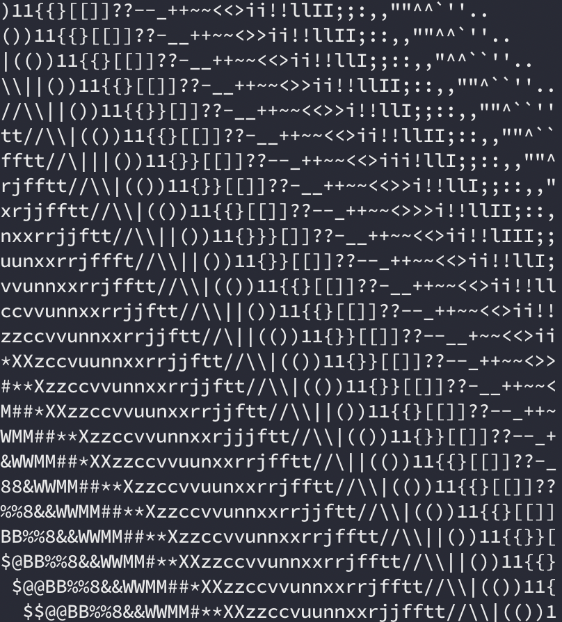

<h1 align="center">Image to ASCII Art</h1>
<h4 align="center">⚠️ Currently Under Development ⚠️</h4>

### Introduction
Simple Python project to convert basic picutes into ASCII art.

#### Main Features
- [x] ASCII Gradient Scale
- [x] Image to ASCII rendered to the terminal
- [x] Compressed output, allowing for consisted images
- [ ] Load your own images

#### Wishful Thinking
- [ ] Turn into simple commandline tool

### Function
At the moment the gradient recognition works pretty well, and character placement should be alright.

	
	

**Note:**
- Currently written functionally, rather than using objects. Code needs a revamp to allow for image importation.
